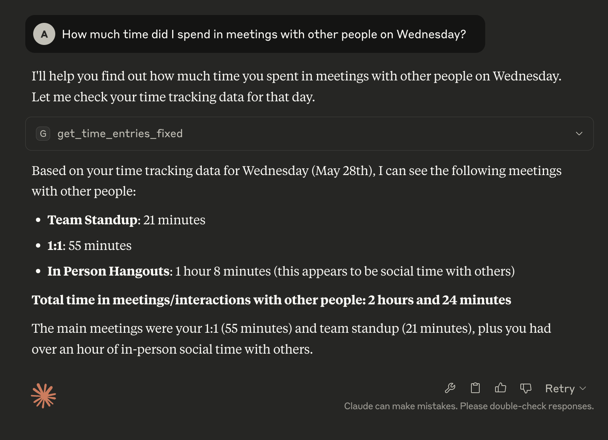

# Toggl Track MCP Server

A Model Context Protocol (MCP) server for Toggl Track time tracking integration. This server allows Claude and other MCP clients to interact with your Toggl Track account to manage projects and time entries.

> This server is 100% written by Claude Code, except for BUILD_APP.md, which I wrote to guide the creation of the server
> This has not be extensively tested (honestly, I've barely read the code!) so improvements can definitely be made.



## Features

- **Get Projects**: Retrieve all projects from your Toggl Track account
- **Get Workspaces**: List all workspaces associated with your account
- **Get Time Entries**: Detailed time entries with filtering by date range and project
- **Time Summary**: Aggregated time reports by project with percentages
- **Current Timer**: Check what's currently running and elapsed time
- **Timer Control**: Start new timers and stop current running timers
- **Search Entries**: Find time entries by description text
- **Smart Prompts**: Pre-built conversation starters for common time tracking queries
- Secure API token authentication
- Formatted, readable output for LLM consumption

## Quick Start

### 1. Get Your Toggl Track API Token

1. Go to your [Toggl Track profile settings](https://track.toggl.com/profile)
2. Copy your API token from the "API Token" section
3. Keep this token handy for the configuration step

### 2. Build the Docker Image

Clone this repository and build the Docker image:

```bash
git clone git@github.com:vontell/toggl-track-mcp.git
cd toggl-track-mcp
docker build -t toggl-track-mcp .
```

### 3. Configure Claude Desktop

Add the server to your Claude Desktop configuration file:

**Location:** `~/Library/Application Support/Claude/claude_desktop_config.json` (macOS)

```json
{
  "mcpServers": {
    "Toggl Track": {
      "command": "docker",
      "args": [
        "run",
        "-i",
        "--rm",
        "-e",
        "TOGGL_API_TOKEN",
        "toggl-track-mcp"
      ],
      "env": {
        "TOGGL_API_TOKEN": "your_api_token_here"
      }
    }
  }
}
```

**Important:** Replace `"your_api_token_here"` with your actual Toggl Track API token.

### 4. Restart Claude Desktop

After updating the configuration, restart Claude Desktop to load the new MCP server.

### 5. Verify Installation

Once restarted, you should be able to ask Claude questions like:
- "What projects do I have in Toggl Track?"
- "Start a timer for 'Code review'"
- "What's my current timer status?"

---

## Development Setup

For development and testing:

### Local Development

Create a virtual environment:

```bash
python -m venv .venv
source .venv/bin/activate  # On Windows: venv\Scripts\activate
```

Install dependencies:

```bash
pip install -r requirements.txt
```

Set your API token:

```bash
export TOGGL_API_TOKEN="your_api_token_here"
```

### Testing with MCP Inspector

```bash
mcp dev server.py
```

This opens the MCP Inspector for interactive testing.

## Available Tools

### `get_projects`

Retrieves all projects from your Toggl Track account with details including:

- Project name
- Workspace ID
- Associated client
- Color coding
- Privacy settings

### `get_workspaces`

Lists all workspaces associated with your Toggl Track account with:

- Workspace name
- Workspace ID

### `get_time_entries`

Get detailed time entries with optional filtering:

- **start_date**: Filter by start date (YYYY-MM-DD format, defaults to 7 days ago)
- **end_date**: Filter by end date (YYYY-MM-DD format, defaults to today)
- **project_name**: Filter by specific project name
- Shows entries grouped by date with descriptions, durations, and daily totals

### `get_time_summary`

Get aggregated time summary by project:

- **start_date**: Start date for summary (defaults to 7 days ago)
- **end_date**: End date for summary (defaults to today)
- **project_name**: Focus on specific project (optional)
- Shows total hours by project with percentages and grand total

### `get_current_timer`

Check currently running timer:

- Shows active project and description
- Displays elapsed time and start time
- Returns "No timer running" if nothing is active

### `start_timer`

Start a new timer:

- **description**: Description for the time entry (required)
- **project_name**: Name of project to assign timer to (optional)
- Automatically uses your primary workspace
- Returns confirmation with timer details

### `stop_current_timer`

Stop the currently running timer:

- Stops any active timer
- Shows final duration and time period
- Returns "No timer running" if nothing is active

### `search_time_entries`

Search time entries by description:

- **query**: Text to search for in descriptions (required)
- **start_date**: Start date for search range (optional, defaults to 30 days ago)
- **end_date**: End date for search range (optional, defaults to today)
- Case-insensitive search with total time calculation

## Example Prompts

The server includes pre-built prompts for common scenarios:

### Time Tracking & Analysis

- **detailed_time_report**: Get detailed breakdown of time entries
- **time_summary_report**: Get aggregated time summary by project
- **productivity_analysis**: Analyze work patterns and productivity
- **current_status_check**: Check current timer and today's activity
- **project_deep_dive**: In-depth analysis of specific project work
- **search_by_description**: Search time entries by description text

### Timer Control

- **quick_start_timer**: Start a timer with description and optional project
- **stop_and_start_new**: Stop current timer and start a new one
- **timer_status_and_control**: Check status and get timer control options
- **work_session_timer**: Start a focused work session with break reminders

## Example Usage

Once installed in Claude Desktop, you can ask:

### Project & Workspace Queries

- "What projects do I have in Toggl Track?"
- "Show me my Toggl workspaces"
- "List all my time tracking projects"

### Time Entry Analysis

- "Show me my time entries for the last week"
- "What did I work on yesterday?"
- "Give me a time summary for project X"
- "How much time did I spend on each project this month?"
- "Search my time entries for 'meeting' this week"

### Timer Control

- "What's my current timer status?"
- "Start a timer for 'Code review' on project ABC"
- "Stop my current timer"
- "Start a timer for 'Planning session'"

## API Reference

This server uses the [Toggl Track API v9](https://developers.track.toggl.com/docs/). Key endpoints used:

- `GET /api/v9/me/projects` - Get user projects
- `GET /api/v9/workspaces` - Get user workspaces
- `GET /api/v9/me/time_entries` - Get time entries
- `GET /api/v9/me/time_entries/current` - Get current running timer
- `POST /api/v9/workspaces/{id}/time_entries` - Start new timer
- `PATCH /api/v9/workspaces/{id}/time_entries/{id}/stop` - Stop timer

## Development

### Project Structure

```
toggl-track-mcp/
├── server.py              # Main MCP server implementation
├── requirements.txt       # Python dependencies
├── .env.example          # Environment variable template
└── README.md             # This file
```

### Adding New Features

To extend this server with additional Toggl Track functionality:

1. Add new methods to the `TogglClient` class
2. Create new `@mcp.tool()` decorated functions
3. Handle authentication and error cases
4. Update this README with the new capabilities

## Authentication

This server uses Toggl Track's API token authentication method. The token should be provided via the `TOGGL_API_TOKEN` environment variable.

**Security Note**: Never commit your API token to version control. Always use environment variables or secure configuration management.

## Error Handling

The server includes comprehensive error handling for:

- Missing API token configuration
- Network connectivity issues
- API authentication failures
- Malformed API responses

## Rate Limiting

Toggl Track API has rate limiting (approximately 1 request per second). The server respects these limits and provides appropriate error messages if limits are exceeded.

## Contributing

Feel free to submit issues and enhancement requests!

## License

This project is open source and available under standard terms.
